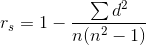

# Spearman Correlation Coefficient

## Now what is Spearman Correlation Coefficient?

Spearman's correlation applies to ranks and so provides a measure of a monotonic relationship between two continuous random variables. It is also useful with ordinal data and is robust to outliers (unlike Pearson's correlation). You can read more on Spearman Correlation Coefficient and how it is calculate [here](http://www.statisticshowto.com/spearman-rank-correlation-definition-calculate/)

**Spearman Correlation Coefficient can be calculated as follows :**

where d - difference between the ranks and n - sample size

* Find the ranks for each individual row in a column. The values can be ranked as per any criteria.
For simplicity, we can rank them in a increasing order of values.

* Add a column 'd', which would store the difference between the row values for the 2 columns selected above.

* Add another column 'd-squared', which would contain the values for squares for each element in the 'd' column.

* Sum up all the values in the 'd-squared' column.

* Substitute these values in the Spearman's Rank Correlation formula.

For these you don't need to load the data, we have already done it for you.

## Write a function `spearman_correlation()` that

Calculates the Spearman Correlation Coefficient between the SalePrice column for the loaded datasets.

### Parameters:

None 

The required data has already been loaded for you.

### Returns:

| Return | dtype | description |
| --- | --- | --- | 
| Spearman Correlation Coefficient| Float | Spearman Correlation Coeffecient between SalePrice column of the loaded datasets|
